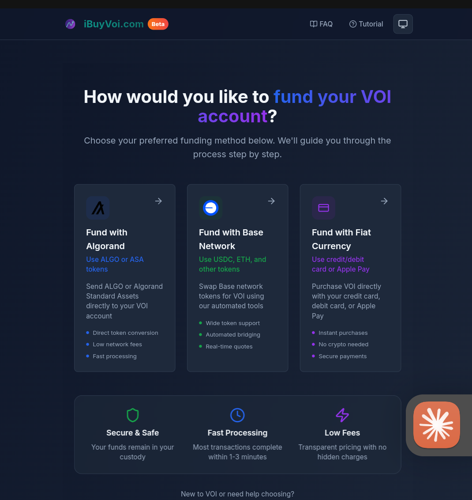
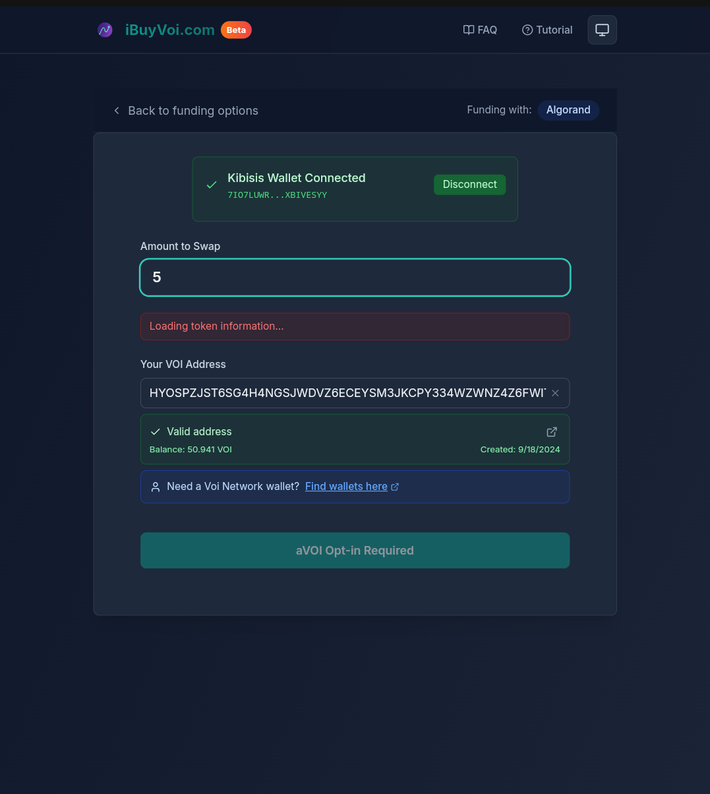
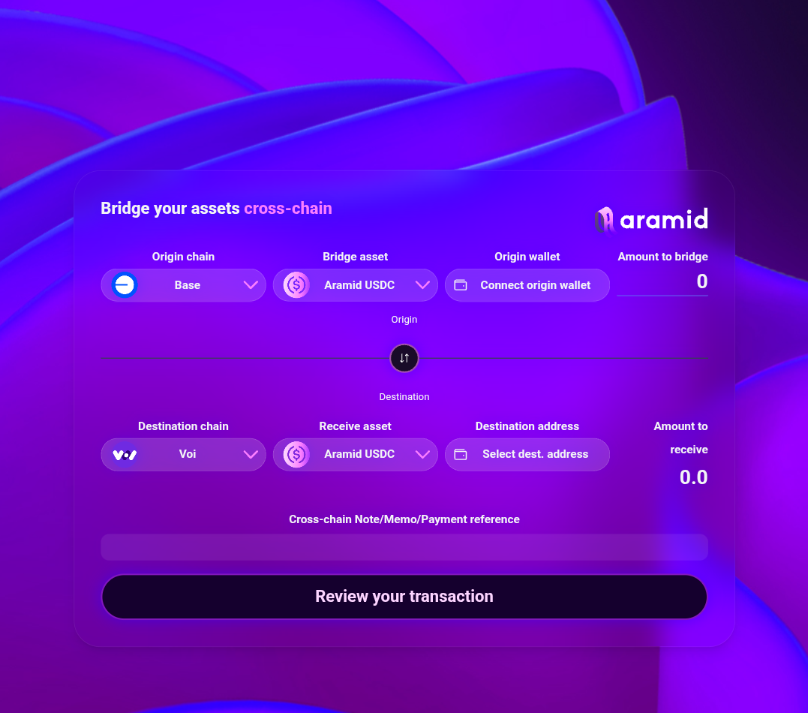
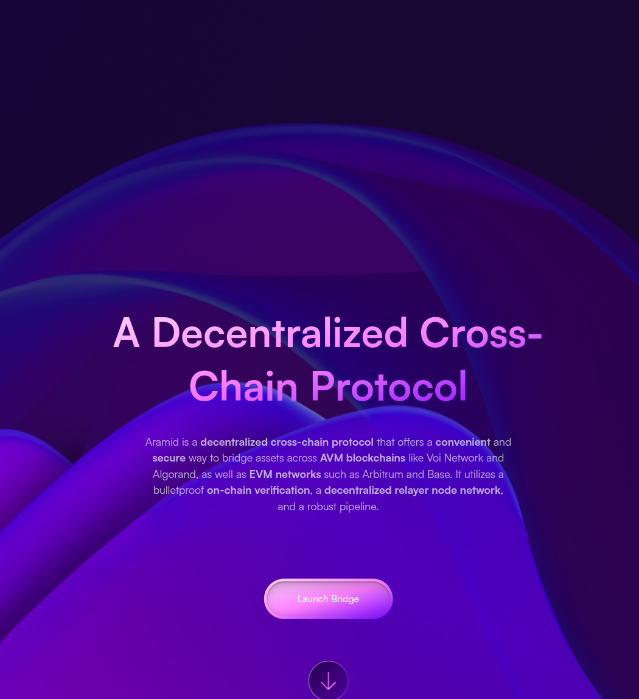
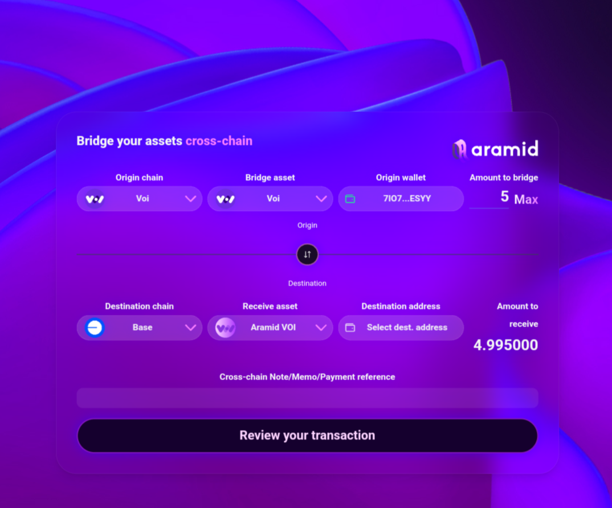
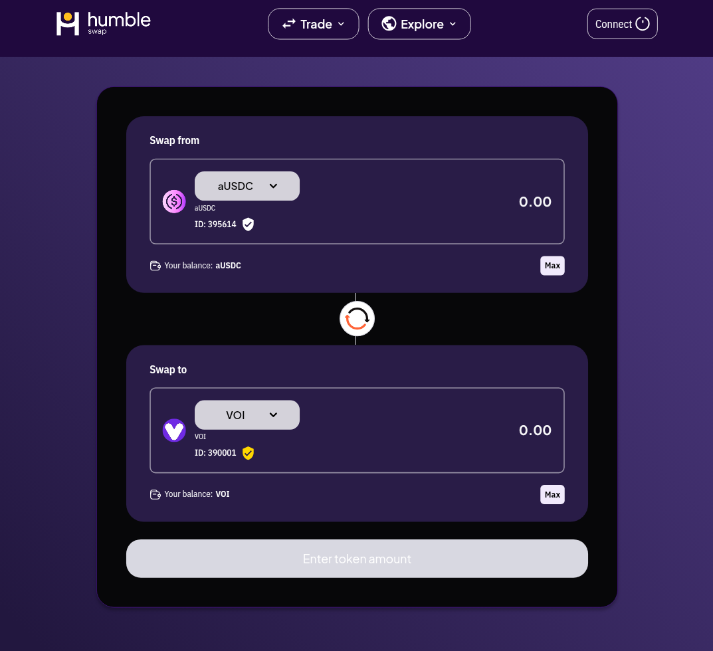

# Acquiring VOI

There are three ways to get VOI tokens onto the Voi blockchain. You can buy directly using fiat or crypto via iBuyVoi, purchase on a centralized exchange if you are located outside the United States, or bridge assets from another blockchain using Aramid Finance. Read through the options below and pick the one that works best for you.

---

## Before You Start

You will need a Voi compatible wallet set up before you can receive VOI. If you do not have one yet, set one up first using one of the wallets below.

- [Kibisis](https://kibis.is/) - Browser extension wallet, most popular in the Voi ecosystem
- [Lute](https://lute.app/) - Web based wallet with strong Ledger hardware support
- [Biatec](https://wallet.biatec.io/) - Web based wallet option

When setting up your wallet, write down your seed phrase and store it somewhere safe. Anyone with your seed phrase has full access to your funds. Do not share it with anyone.

---

## Option A: Buy Directly via iBuyVoi (Recommended)

iBuyVoi is the simplest way to get VOI and works for users everywhere including the United States. You can fund your Voi wallet using fiat currency, Algorand or Base chain assets directly without needing a centralized exchange account.

1. Go to [iBuyVoi](https://www.ibuyvoi.com/)
2. Select your funding method, fiat currency, Algorand or Base
3. Enter your Voi wallet address as the destination

4. Enter the amount you want to acquire
5. Complete the transaction and wait for VOI to arrive in your wallet

---

## Option B: Bridge from Another Chain

If you have assets on Algorand, Base or Arbitrum you can bridge them to the Voi blockchain using [Aramid Finance](https://www.aramid.finance/). This is also the recommended route for US based users who cannot use the centralized exchanges above.

You can bridge two types of assets to Voi:

- **aVOI (Aramid VOI)** from Algorand, which arrives as VOI directly in your Voi wallet
- **USDC** from Algorand, Base or Arbitrum, which arrives as Aramid USDC on Voi and needs one additional swap step to become VOI

### Bridging aVOI or USDC to Voi

1. Make sure you have a Voi compatible wallet ready to receive your tokens (Kibisis, Lute or Biatec)
2. Go to [Aramid Finance](https://www.aramid.finance/) and click Launch Bridge

3. Select your origin chain (Algorand, Base or Arbitrum) and the asset you are bridging (aVOI or USDC)
4. Connect your origin chain wallet

5. Enter your Voi wallet address in the Destination Address field
6. Enter the amount you want to bridge and click Review Transaction

7. Sign the transaction in your origin wallet and wait for the bridge to process. This can take a few minutes.

### If You Bridged USDC: Swap to VOI

If you bridged USDC it will arrive as Aramid USDC in your Voi wallet. You need one more step to convert it to VOI using a DEX on the Voi blockchain.

1. Go to [Humble](https://voi.humble.sh/) or [Nomadex](https://voi.nomadex.app/) and connect your Voi wallet
2. Select Aramid USDC as the input token and VOI as the output token

3. Enter the amount and complete the swap
4. You now have VOI on the Voi blockchain

If you bridged aVOI directly it arrives as VOI automatically and no swap is needed.

---

## Getting Help

If you run into any issues at any step, head to the **#support** channel in the [Voi Discord](https://discord.gg/voi-network) where community members and the core team can help you out.